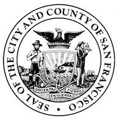

Predicting crime in San Francisco (Kaggle)
==========================================

Content
-------
[Model/Prediction](predicition.ipynb)
[Visualisation](visualisation.ipynb)

Results
-------
*TBH*

Contact
-------
Sebastian Klatt [sebastian@markow.io](mailto:sebastian@markow.io)

License
-------
All source code and documentation are released under MIT license.  
See `LICENSE` file for full license text.
